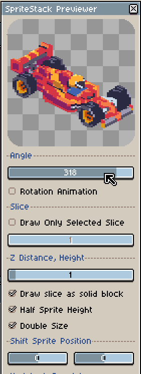
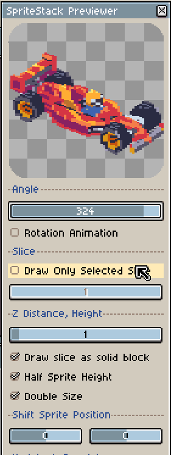
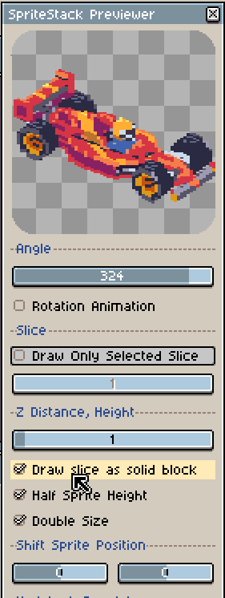
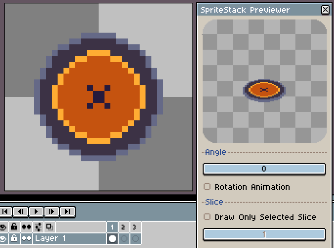
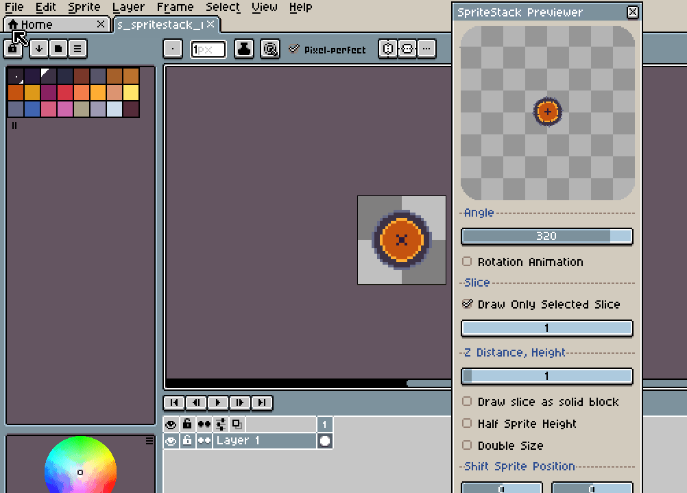

# Introduction
Scripts for @Aseprite program.
**Requirements: Aseprite v1.3-rc2**

### SpriteStack Previewer
Auxiliary window for displaying a sprite using Sprite Stack technology. Each frame is a slice.The window displays a preview of the sprite.  
Features:
- Real-time preview
- Sprite Stack in 360 degrees.
- Ability to view each slice.
- Changing the distance between slices.
- Filling the distance between slices with "hard pixels".
- Double zoomed preview.
- Preview with reduced sprite height (camera tilt effect).
This script does NOT create a SpriteStack, it is just a preview that affects the convenience of creating such sprites.

  

### SpriteStack Slicer
Creates a new sprite based on a flat sprite image by slicing it along vertical lines.

# Installation
1. Copy files _"SpriteStack_Previewer.lua"_ and _"SpriteStack_Slicer.lua"_.
2. Paste these files to the path **"%AppData%/Aseprite/scripts/"**.
3. Start Aseprite or, if the program is running, click **File > Scripts > Rescan Scripts Folder**.
4. The scripts will appear in **File > Scripts**.

# LICENSES
The scripts are distributed under the [MIT license](LICENSE.txt).

Sprites are distributed under [CC-BY-NC4.0 license](https://creativecommons.org/licenses/by-nc/4.0/). 

